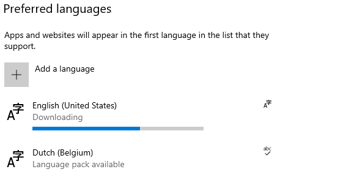
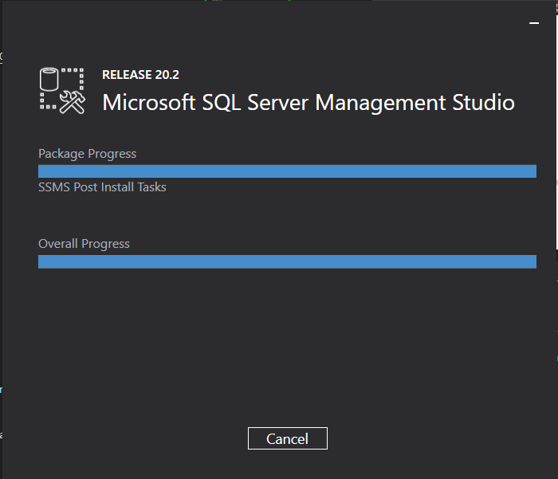
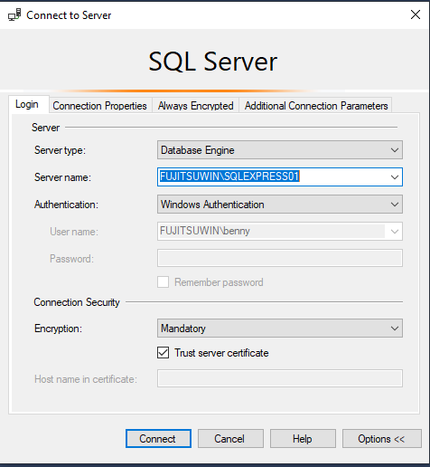
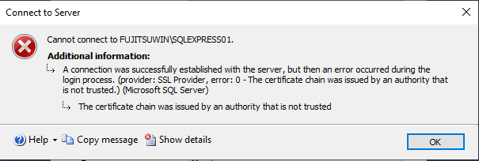
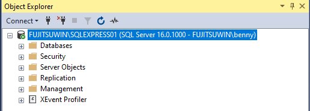
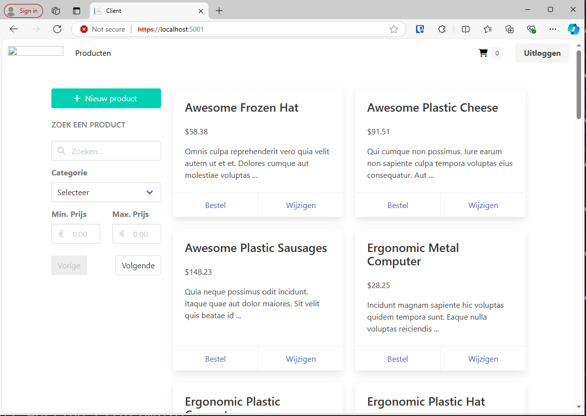
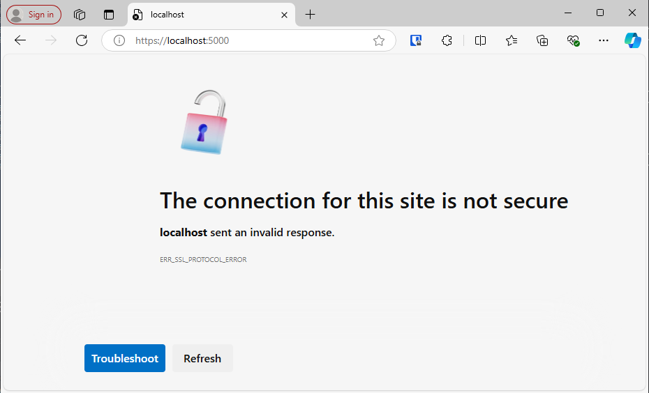

# SportStore

This project is a very simple e-commerce website for sports products.

## Requirements

- [.NET 6.0 SDK](https://dotnet.microsoft.com/en-us/download)

   ```bash
   PS C:\Windows\system32> winget search Microsoft.DotNet.SDK
   Name                           Id                           Version               Source
   -----------------------------------------------------------------------------------------
   Microsoft .NET SDK 3.1         Microsoft.DotNet.SDK.3_1     3.1.426               winget
   Microsoft .NET SDK 5.0         Microsoft.DotNet.SDK.5       5.0.408               winget
   Microsoft .NET SDK 6.0         Microsoft.DotNet.SDK.6       6.0.427               winget
   Microsoft .NET SDK 7.0         Microsoft.DotNet.SDK.7       7.0.410               winget
   Microsoft .NET SDK 8.0         Microsoft.DotNet.SDK.8       8.0.403               winget
   Microsoft .NET SDK 9.0 Preview Microsoft.DotNet.SDK.Preview 9.0.100-rc.2.24474.11 winget
   PS C:\Windows\system32> winget install --id Microsoft.DotNet.SDK --source winget
   No package found matching input criteria.
   PS C:\Windows\system32> winget install --id Microsoft.DotNet.SDK.6 --source winget
   Found Microsoft .NET SDK 6.0 [Microsoft.DotNet.SDK.6] Version 6.0.427
   This application is licensed to you by its owner.
   Microsoft is not responsible for, nor does it grant any licenses to, third-party packages.
   Downloading https://dotnetcli.azureedge.net/dotnet/Sdk/6.0.427/dotnet-sdk-6.0.427-win-x64.exe
   ██████████████████████████████   195 MB /  195 MB
   Successfully verified installer hash
   Starting package install...
   Successfully installed
   ```

   

- [SQL Server](https://www.microsoft.com/en-us/sql-server/sql-server-downloads)

   ```bash
   PS C:\Windows\system32> winget search Microsoft.SQLServer
   Name                                    Id                                    Version        Source
   ----------------------------------------------------------------------------------------------------
   Microsoft SQL Server 2012 Native Client Microsoft.SQLServer.2012.NativeClient 11.4.7001.0    winget
   Microsoft SQL Server 2017 Developer     Microsoft.SQLServer.2017.Developer    14.0.1000.169  winget
   Microsoft SQL Server 2017 Express       Microsoft.SQLServer.2017.Express      14.0.1000.169  winget
   Microsoft SQL Server 2019 Developer     Microsoft.SQLServer.2019.Developer    15.2204.5490.2 winget
   Microsoft SQL Server 2019 Express       Microsoft.SQLServer.2019.Express      15.2204.5490.2 winget
   Microsoft SQL Server 2022 Developer     Microsoft.SQLServer.2022.Developer    16.0.1000.6    winget
   Microsoft SQL Server 2022 Express       Microsoft.SQLServer.2022.Express      16.0.1000.6    winget
   Microsoft SQL Server Management Studio  Microsoft.SQLServerManagementStudio   20.2           winget
   PS C:\Windows\system32> winget install --id Microsoft.SQLServer.2022.Express --source winget
   Found Microsoft SQL Server 2022 Express [Microsoft.SQLServer.2022.Express] Version 16.0.1000.6
   This application is licensed to you by its owner.
   Microsoft is not responsible for, nor does it grant any licenses to, third-party packages.
   Downloading https://download.microsoft.com/download/5/1/4/5145fe04-4d30-4b85-b0d1-39533663a2f1/SQL2022-SSEI-Expr.exe
   ██████████████████████████████  4.09 MB / 4.09 MB
   Successfully verified installer hash
   Starting package install...
   ```

   ```bash
   Microsoft (R) SQL Server Installer
   Copyright (c) 2022 Microsoft.  All rights reserved.


   Your language Nederlands (België) (nl-BE) is not supported. Continue in English?

   See this for more information: https://docs.microsoft.com/sql/sql-server/install/local-language-versions-in-sql-server


   For more information use /? or /Help.
   Installer failed with exit code: 1009
   ```

   ```Installing the correct language pack ...```

   

   ```bash
   Microsoft (R) SQL Server Installer
   Copyright (c) 2022 Microsoft.  All rights reserved.

   Operation finished with result: Success

   Installation has completed successfully!
   INSTANCE NAME
         SQLEXPRESS01

   SQL ADMINISTRATORS
         FUJITSUWIN\benny

   FEATURES INSTALLED
         SQLENGINE

   VERSION
         16.0.1000.6, RTM

   CONNECTION STRING
         Server=localhost\SQLEXPRESS01;Database=master;Trusted_Connection=True;

   SQL SERVER INSTALL LOG FOLDER
         C:\Program Files\Microsoft SQL Server\160\Setup Bootstrap\Log\20241015_104420

   INSTALLATION MEDIA FOLDER
         C:\SQL2022\Express_ENU

   INSTALLATION RESOURCES FOLDER
         C:\Program Files\Microsoft SQL Server\160\SSEI\Resources

   Successfully installed
   ```

- SSMS

   ```bash
   PS C:\Windows\system32> winget install --id Microsoft.SQLServerManagementStudio --source winget
   Found Microsoft SQL Server Management Studio [Microsoft.SQLServerManagementStudio] Version 20.2
   This application is licensed to you by its owner.
   Microsoft is not responsible for, nor does it grant any licenses to, third-party packages.
   Downloading https://download.microsoft.com/download/9/b/e/9bee9f00-2ee2-429a-9462-c9bc1ce14c28/SSMS-Setup-ENU.exe
   ██████████████████████████████   473 MB /  473 MB
   Successfully verified installer hash
   Starting package install...
   Successfully installed
   ```

   

   `Connecting with SSMS to verify running SQL Server`

   

   `Note: trust the certificate or else ...`

   

   

## How to run in development

> These steps assume that you have a SQL Server instance running on your machine. If not, you can use the [SQL Server Docker image](https://hub.docker.com/_/microsoft-mssql-server) to run one. Make sure to set the correct connection string of the SQL Server instance in `src/Server/appsettings.Development.json`.

1. Clone the repository

```bash
benny@fujitsuwin MINGW64 /c/DATA/GIT/DEVOPS
$ git clone https://github.com/HoGentTIN/p3ops-demo-app.git
Cloning into 'p3ops-demo-app'...
remote: Enumerating objects: 184, done.
remote: Counting objects: 100% (37/37), done.
remote: Compressing objects: 100% (31/31), done.
remote: Total 184 (delta 13), reused 6 (delta 6), pack-reused 147 (from 1)
Receiving objects: 100% (184/184), 55.83 KiB | 985.00 KiB/s, done.
Resolving deltas: 100% (38/38), done.

benny@fujitsuwin MINGW64 /c/DATA/GIT/DEVOPS
$ mv p3ops-demo-app/ p3ops-demo-app-BennyClemmens/

benny@fujitsuwin MINGW64 /c/DATA/GIT/DEVOPS/p3ops-demo-app-BennyClemmens (main)
$ git remote remove origin

benny@fujitsuwin MINGW64 /c/DATA/GIT/DEVOPS/p3ops-demo-app-BennyClemmens (main)
$ git remote add origin https://github.com/BennyClemmens/p3ops-demo-app-BennyClemmens.git

benny@fujitsuwin MINGW64 /c/DATA/GIT/DEVOPS/p3ops-demo-app-BennyClemmens (main)
$ git push -u origin
fatal: The current branch main has no upstream branch.
To push the current branch and set the remote as upstream, use

    git push --set-upstream origin main

To have this happen automatically for branches without a tracking
upstream, see 'push.autoSetupRemote' in 'git help config'.


benny@fujitsuwin MINGW64 /c/DATA/GIT/DEVOPS/p3ops-demo-app-BennyClemmens (main)
$ git push --set-upstream origin main
Enumerating objects: 184, done.
Counting objects: 100% (184/184), done.
Delta compression using up to 4 threads
Compressing objects: 100% (141/141), done.
Writing objects: 100% (184/184), 55.84 KiB | 55.84 MiB/s, done.
Total 184 (delta 38), reused 184 (delta 38), pack-reused 0 (from 0)
remote: Resolving deltas: 100% (38/38), done.
To https://github.com/BennyClemmens/p3ops-demo-app-BennyClemmens.git
 * [new branch]      main -> main
branch 'main' set up to track 'origin/main'.
```

```bash
benny@fujitsuwin MINGW64 /c/DATA/GIT/DEVOPS/p3ops-demo-app-BennyClemmens (main)
$ cat src/Server/appsettings.Development.json
{
  "Logging": {
    "LogLevel": {
      "Default": "Information",
      "Microsoft": "Warning",
      "Microsoft.Hosting.Lifetime": "Information"
    }
  },
  "ConnectionStrings": {
    "SqlDatabase": "Server=(localdb)\\mssqllocaldb;Database=SportStore;Trusted_Connection=True;"
  }
}
```

```bash
benny@fujitsuwin MINGW64 /c/DATA/GIT/DEVOPS/p3ops-demo-app-BennyClemmens (main)
$ cat src/Server/appsettings.Development.json
{
  "Logging": {
    "LogLevel": {
      "Default": "Information",
      "Microsoft": "Warning",
      "Microsoft.Hosting.Lifetime": "Information"
    }
  },
  "ConnectionStrings": {
    "SqlDatabase": "Server=localhost\\SQLEXPRESS01;Database=master;Trusted_Connection=True;"
  }
}
```

2. Restore the packages: `dotnet restore src/Server/Server.csproj`

`Note: restart the terminal to pick up the donetcommand in the path`

```bash
benny@fujitsuwin MINGW64 /c/DATA/GIT/DEVOPS/p3ops-demo-app-BennyClemmens (main)
$ dotnet restore src/Server/Server.csproj

Welcome to .NET 6.0!
---------------------
SDK Version: 6.0.427

Telemetry
---------
The .NET tools collect usage data in order to help us improve your experience. It is collected by Microsoft and shared with the community. You can opt-out of telemetry by setting the DOTNET_CLI_TELEMETRY_OPTOUT environment variable to '1' or 'true' using your favorite shell.

Read more about .NET CLI Tools telemetry: https://aka.ms/dotnet-cli-telemetry

----------------
Installed an ASP.NET Core HTTPS development certificate.
To trust the certificate run 'dotnet dev-certs https --trust' (Windows and macOS only).
Learn about HTTPS: https://aka.ms/dotnet-https
----------------
Write your first app: https://aka.ms/dotnet-hello-world
Find out what's new: https://aka.ms/dotnet-whats-new
Explore documentation: https://aka.ms/dotnet-docs
Report issues and find source on GitHub: https://github.com/dotnet/core
Use 'dotnet --help' to see available commands or visit: https://aka.ms/dotnet-cli
--------------------------------------------------------------------------------------
  Determining projects to restore...
  Restored C:\DATA\GIT\DEVOPS\p3ops-demo-app-BennyClemmens\src\Shared\Shared.csproj (in 6.91 sec).
  Restored C:\DATA\GIT\DEVOPS\p3ops-demo-app-BennyClemmens\src\Domain\Domain.csproj (in 520 ms).
  Restored C:\DATA\GIT\DEVOPS\p3ops-demo-app-BennyClemmens\src\Persistence\Persistence.csproj (in 13.53 sec).
  Restored C:\DATA\GIT\DEVOPS\p3ops-demo-app-BennyClemmens\src\Services\Services.csproj (in 26.27 sec).
  Restored C:\DATA\GIT\DEVOPS\p3ops-demo-app-BennyClemmens\src\Server\Server.csproj (in 26.27 sec).
  Restored C:\DATA\GIT\DEVOPS\p3ops-demo-app-BennyClemmens\src\Client\Client.csproj (in 26.27 sec).
```

3. Start the server: `dotnet run watch --project src/Server/Server.csproj`

```bash
benny@fujitsuwin MINGW64 /c/DATA/GIT/DEVOPS/p3ops-demo-app-BennyClemmens (main)
$ dotnet run watch --project src/Server/Server.csproj
Building...
C:\DATA\GIT\DEVOPS\p3ops-demo-app-BennyClemmens\src\Server\Startup.cs(45,17): warning CS0618: 'FluentValidationMvcConfiguration.RegisterValidatorsFromAssemblyContaining<T>(Func<AssemblyScanner.AssemblyScanResult, bool>, ServiceLifetime, bool)' is obsolete: 'RegisterValidatorsFromAssemblyContaining is deprecated. Call services.AddValidatorsFromAssemblyContaining<T> instead, which has the same effect. See https://github.com/FluentValidation/FluentValidation/issues/1963' [C:\DATA\GIT\DEVOPS\p3ops-demo-app-BennyClemmens\src\Server\Server.csproj]
C:\DATA\GIT\DEVOPS\p3ops-demo-app-BennyClemmens\src\Server\Startup.cs(46,17): warning CS0618: 'FluentValidationAutoValidationConfiguration.ImplicitlyValidateChildProperties' is obsolete: 'Implicit validation of child properties deprecated and will be removed in a future release. Please use SetValidator instead. For details see https://github.com/FluentValidation/FluentValidation/issues/1960' [C:\DATA\GIT\DEVOPS\p3ops-demo-app-BennyClemmens\src\Server\Server.csproj]
C:\DATA\GIT\DEVOPS\p3ops-demo-app-BennyClemmens\src\Server\Startup.cs(43,13): warning CS0618: 'FluentValidationMvcExtensions.AddFluentValidation(IMvcBuilder, Action<FluentValidationMvcConfiguration>)' is obsolete: 'Calling AddFluentValidation() is deprecated. Call services.AddFluentValidationAutoValidation().AddFluentValidationClientsideAdapters() instead, which has the same effect. For details see https://github.com/FluentValidation/FluentValidation/issues/1965' [C:\DATA\GIT\DEVOPS\p3ops-demo-app-BennyClemmens\src\Server\Server.csproj]
warn: Microsoft.EntityFrameworkCore.Model.Validation[10400]
      Sensitive data logging is enabled. Log entries and exception messages may include sensitive application data; this mode should only be enabled during development.
fail: Microsoft.EntityFrameworkCore.Database.Command[20102]
      Failed executing DbCommand (0ms) [Parameters=[], CommandType='Text', CommandTimeout='60']
      IF SERVERPROPERTY('EngineEdition') <> 5
      BEGIN
          ALTER DATABASE [master] SET SINGLE_USER WITH ROLLBACK IMMEDIATE;
      END;
crit: Microsoft.AspNetCore.Hosting.Diagnostics[6]
      Application startup exception
      Microsoft.Data.SqlClient.SqlException (0x80131904): Option 'SINGLE_USER' cannot be set in database 'master'.
         at Microsoft.Data.SqlClient.SqlConnection.OnError(SqlException exception, Boolean breakConnection, Action`1 wrapCloseInAction)
         at Microsoft.Data.SqlClient.SqlInternalConnection.OnError(SqlException exception, Boolean breakConnection, Action`1 wrapCloseInAction)
         at Microsoft.Data.SqlClient.TdsParser.ThrowExceptionAndWarning(TdsParserStateObject stateObj, Boolean callerHasConnectionLock, Boolean asyncClose)
         at Microsoft.Data.SqlClient.TdsParser.TryRun(RunBehavior runBehavior, SqlCommand cmdHandler, SqlDataReader dataStream, BulkCopySimpleResultSet bulkCopyHandler, TdsParserStateObject stateObj, Boolean& dataReady)
         at Microsoft.Data.SqlClient.SqlCommand.RunExecuteNonQueryTds(String methodName, Boolean isAsync, Int32 timeout, Boolean asyncWrite)
         at Microsoft.Data.SqlClient.SqlCommand.InternalExecuteNonQuery(TaskCompletionSource`1 completion, Boolean sendToPipe, Int32 timeout, Boolean& usedCache, Boolean asyncWrite, Boolean inRetry, String methodName)
         at Microsoft.Data.SqlClient.SqlCommand.ExecuteNonQuery()
         at Microsoft.EntityFrameworkCore.Storage.RelationalCommand.ExecuteNonQuery(RelationalCommandParameterObject parameterObject)
         at Microsoft.EntityFrameworkCore.Migrations.MigrationCommand.ExecuteNonQuery(IRelationalConnection connection, IReadOnlyDictionary`2 parameterValues)
         at Microsoft.EntityFrameworkCore.Migrations.Internal.MigrationCommandExecutor.ExecuteNonQuery(IEnumerable`1 migrationCommands, IRelationalConnection connection)
         at Microsoft.EntityFrameworkCore.SqlServer.Storage.Internal.SqlServerDatabaseCreator.Delete()
         at Microsoft.EntityFrameworkCore.Storage.RelationalDatabaseCreator.EnsureDeleted()
         at Microsoft.EntityFrameworkCore.Infrastructure.DatabaseFacade.EnsureDeleted()
         at Persistence.SportStoreDataInitializer.SeedData() in C:\DATA\GIT\DEVOPS\p3ops-demo-app-BennyClemmens\src\Persistence\SportStoreDataInitializer.cs:line 16
         at Server.Startup.Configure(IApplicationBuilder app, IWebHostEnvironment env, SportStoreDataInitializer dataInitializer) in C:\DATA\GIT\DEVOPS\p3ops-demo-app-BennyClemmens\src\Server\Startup.cs:line 76
         at System.RuntimeMethodHandle.InvokeMethod(Object target, Span`1& arguments, Signature sig, Boolean constructor, Boolean wrapExceptions)
         at System.Reflection.RuntimeMethodInfo.Invoke(Object obj, BindingFlags invokeAttr, Binder binder, Object[] parameters, CultureInfo culture)
         at Microsoft.AspNetCore.Hosting.ConfigureBuilder.Invoke(Object instance, IApplicationBuilder builder)
         at Microsoft.AspNetCore.Hosting.ConfigureBuilder.<>c__DisplayClass4_0.<Build>b__0(IApplicationBuilder builder)
         at Microsoft.AspNetCore.Hosting.GenericWebHostBuilder.<>c__DisplayClass15_0.<UseStartup>b__1(IApplicationBuilder app)
         at Microsoft.AspNetCore.Mvc.Filters.MiddlewareFilterBuilderStartupFilter.<>c__DisplayClass0_0.<Configure>g__MiddlewareFilterBuilder|0(IApplicationBuilder builder)
         at Microsoft.AspNetCore.HostFilteringStartupFilter.<>c__DisplayClass0_0.<Configure>b__0(IApplicationBuilder app)
         at Microsoft.AspNetCore.Hosting.GenericWebHostService.StartAsync(CancellationToken cancellationToken)
      ClientConnectionId:b9fd1afc-4617-4f4a-a9ef-41a3fe69d714
      Error Number:5058,State:5,Class:16
Unhandled exception. Microsoft.Data.SqlClient.SqlException (0x80131904): Option 'SINGLE_USER' cannot be set in database 'master'.
   at Microsoft.Data.SqlClient.SqlConnection.OnError(SqlException exception, Boolean breakConnection, Action`1 wrapCloseInAction)
   at Microsoft.Data.SqlClient.SqlInternalConnection.OnError(SqlException exception, Boolean breakConnection, Action`1 wrapCloseInAction)
   at Microsoft.Data.SqlClient.TdsParser.ThrowExceptionAndWarning(TdsParserStateObject stateObj, Boolean callerHasConnectionLock, Boolean asyncClose)
   at Microsoft.Data.SqlClient.TdsParser.TryRun(RunBehavior runBehavior, SqlCommand cmdHandler, SqlDataReader dataStream, BulkCopySimpleResultSet bulkCopyHandler, TdsParserStateObject stateObj, Boolean& dataReady)
   at Microsoft.Data.SqlClient.SqlCommand.RunExecuteNonQueryTds(String methodName, Boolean isAsync, Int32 timeout, Boolean asyncWrite)
   at Microsoft.Data.SqlClient.SqlCommand.InternalExecuteNonQuery(TaskCompletionSource`1 completion, Boolean sendToPipe, Int32 timeout, Boolean& usedCache, Boolean asyncWrite, Boolean inRetry, String methodName)
   at Microsoft.Data.SqlClient.SqlCommand.ExecuteNonQuery()
   at Microsoft.EntityFrameworkCore.Storage.RelationalCommand.ExecuteNonQuery(RelationalCommandParameterObject parameterObject)
   at Microsoft.EntityFrameworkCore.Migrations.MigrationCommand.ExecuteNonQuery(IRelationalConnection connection, IReadOnlyDictionary`2 parameterValues)
   at Microsoft.EntityFrameworkCore.Migrations.Internal.MigrationCommandExecutor.ExecuteNonQuery(IEnumerable`1 migrationCommands, IRelationalConnection connection)
   at Microsoft.EntityFrameworkCore.SqlServer.Storage.Internal.SqlServerDatabaseCreator.Delete()
   at Microsoft.EntityFrameworkCore.Storage.RelationalDatabaseCreator.EnsureDeleted()
   at Microsoft.EntityFrameworkCore.Infrastructure.DatabaseFacade.EnsureDeleted()
   at Persistence.SportStoreDataInitializer.SeedData() in C:\DATA\GIT\DEVOPS\p3ops-demo-app-BennyClemmens\src\Persistence\SportStoreDataInitializer.cs:line 16
   at Server.Startup.Configure(IApplicationBuilder app, IWebHostEnvironment env, SportStoreDataInitializer dataInitializer) in C:\DATA\GIT\DEVOPS\p3ops-demo-app-BennyClemmens\src\Server\Startup.cs:line 76
   at System.RuntimeMethodHandle.InvokeMethod(Object target, Span`1& arguments, Signature sig, Boolean constructor, Boolean wrapExceptions)
   at System.Reflection.RuntimeMethodInfo.Invoke(Object obj, BindingFlags invokeAttr, Binder binder, Object[] parameters, CultureInfo culture)
   at Microsoft.AspNetCore.Hosting.ConfigureBuilder.Invoke(Object instance, IApplicationBuilder builder)
   at Microsoft.AspNetCore.Hosting.ConfigureBuilder.<>c__DisplayClass4_0.<Build>b__0(IApplicationBuilder builder)
   at Microsoft.AspNetCore.Hosting.GenericWebHostBuilder.<>c__DisplayClass15_0.<UseStartup>b__1(IApplicationBuilder app)
   at Microsoft.AspNetCore.Mvc.Filters.MiddlewareFilterBuilderStartupFilter.<>c__DisplayClass0_0.<Configure>g__MiddlewareFilterBuilder|0(IApplicationBuilder builder)
   at Microsoft.AspNetCore.HostFilteringStartupFilter.<>c__DisplayClass0_0.<Configure>b__0(IApplicationBuilder app)
   at Microsoft.AspNetCore.Hosting.GenericWebHostService.StartAsync(CancellationToken cancellationToken)
   at Microsoft.Extensions.Hosting.Internal.Host.StartAsync(CancellationToken cancellationToken)
   at Microsoft.Extensions.Hosting.HostingAbstractionsHostExtensions.RunAsync(IHost host, CancellationToken token)
   at Microsoft.Extensions.Hosting.HostingAbstractionsHostExtensions.RunAsync(IHost host, CancellationToken token)
   at Microsoft.Extensions.Hosting.HostingAbstractionsHostExtensions.Run(IHost host)
   at Server.Program.Main(String[] args) in C:\DATA\GIT\DEVOPS\p3ops-demo-app-BennyClemmens\src\Server\Program.cs:line 10
ClientConnectionId:b9fd1afc-4617-4f4a-a9ef-41a3fe69d714
Error Number:5058,State:5,Class:16
```

`changing the database name after making a new database`

```bash
benny@fujitsuwin MINGW64 /c/DATA/GIT/DEVOPS/p3ops-demo-app-BennyClemmens (main)
$ cat src/Server/appsettings.Development.json
{
  "Logging": {
    "LogLevel": {
      "Default": "Information",
      "Microsoft": "Warning",
      "Microsoft.Hosting.Lifetime": "Information"
    }
  },
  "ConnectionStrings": {
    "SqlDatabase": "Server=localhost\\SQLEXPRESS01;Database=test;Trusted_Connection=True;"
  }
}
```

```bash
benny@fujitsuwin MINGW64 /c/DATA/GIT/DEVOPS/p3ops-demo-app-BennyClemmens (main)
$ dotnet run watch --project src/Server/Server.csproj
Building...
C:\DATA\GIT\DEVOPS\p3ops-demo-app-BennyClemmens\src\Server\Startup.cs(46,17): warning CS0618: 'FluentValidationMvcConfiguration.RegisterValidatorsFromAssemblyContaining<T>(Func<AssemblyScanner.AssemblyScanResult, bool>, ServiceLifetime, bool)' is obsolete: 'RegisterValidatorsFromAssemblyContaining is deprecated. Call services.AddValidatorsFromAssemblyContaining<T> instead, which has the same effect. See https://github.com/FluentValidation/FluentValidation/issues/1963' [C:\DATA\GIT\DEVOPS\p3ops-demo-app-BennyClemmens\src\Server\Server.csproj]
C:\DATA\GIT\DEVOPS\p3ops-demo-app-BennyClemmens\src\Server\Startup.cs(48,17): warning CS0618: 'FluentValidationAutoValidationConfiguration.ImplicitlyValidateChildProperties' is obsolete: 'Implicit validation of child properties deprecated and will be removed in a future release. Please use SetValidator instead. For details see https://github.com/FluentValidation/FluentValidation/issues/1960' [C:\DATA\GIT\DEVOPS\p3ops-demo-app-BennyClemmens\src\Server\Server.csproj]
C:\DATA\GIT\DEVOPS\p3ops-demo-app-BennyClemmens\src\Server\Startup.cs(43,13): warning CS0618: 'FluentValidationMvcExtensions.AddFluentValidation(IMvcBuilder, Action<FluentValidationMvcConfiguration>)' is obsolete: 'Calling AddFluentValidation() is deprecated. Call services.AddFluentValidationAutoValidation().AddFluentValidationClientsideAdapters() instead, which has the same effect. For details see https://github.com/FluentValidation/FluentValidation/issues/1965' [C:\DATA\GIT\DEVOPS\p3ops-demo-app-BennyClemmens\src\Server\Server.csproj]
warn: Microsoft.EntityFrameworkCore.Model.Validation[10400]
      Sensitive data logging is enabled. Log entries and exception messages may include sensitive application data; this mode should only be enabled during development.
info: EntityFrameworkCore.Triggered.TriggerSession[0]
      Invoking trigger: Persistence.Triggers.OnBeforeEntitySaved as EntityFrameworkCore.Triggered.IBeforeSaveTrigger`1[Domain.Common.Entity]
info: EntityFrameworkCore.Triggered.TriggerSession[0]
      Invoking trigger: Persistence.Triggers.OnBeforeEntitySaved as EntityFrameworkCore.Triggered.IBeforeSaveTrigger`1[Domain.Common.Entity]
info: EntityFrameworkCore.Triggered.TriggerSession[0]
      Invoking trigger: Persistence.Triggers.OnBeforeEntitySaved as EntityFrameworkCore.Triggered.IBeforeSaveTrigger`1[Domain.Common.Entity]
info: EntityFrameworkCore.Triggered.TriggerSession[0]
      Invoking trigger: Persistence.Triggers.OnBeforeEntitySaved as EntityFrameworkCore.Triggered.IBeforeSaveTrigger`1[Domain.Common.Entity]
info: EntityFrameworkCore.Triggered.TriggerSession[0]
      Invoking trigger: Persistence.Triggers.OnBeforeEntitySaved as EntityFrameworkCore.Triggered.IBeforeSaveTrigger`1[Domain.Common.Entity]
info: EntityFrameworkCore.Triggered.TriggerSession[0]
      Invoking trigger: Persistence.Triggers.OnBeforeEntitySaved as EntityFrameworkCore.Triggered.IBeforeSaveTrigger`1[Domain.Common.Entity]
info: EntityFrameworkCore.Triggered.TriggerSession[0]
      Invoking trigger: Persistence.Triggers.OnBeforeEntitySaved as EntityFrameworkCore.Triggered.IBeforeSaveTrigger`1[Domain.Common.Entity]
info: EntityFrameworkCore.Triggered.TriggerSession[0]
      Invoking trigger: Persistence.Triggers.OnBeforeEntitySaved as EntityFrameworkCore.Triggered.IBeforeSaveTrigger`1[Domain.Common.Entity]
info: EntityFrameworkCore.Triggered.TriggerSession[0]
      Invoking trigger: Persistence.Triggers.OnBeforeEntitySaved as EntityFrameworkCore.Triggered.IBeforeSaveTrigger`1[Domain.Common.Entity]
info: EntityFrameworkCore.Triggered.TriggerSession[0]
      Invoking trigger: Persistence.Triggers.OnBeforeEntitySaved as EntityFrameworkCore.Triggered.IBeforeSaveTrigger`1[Domain.Common.Entity]
info: EntityFrameworkCore.Triggered.TriggerSession[0]
      Invoking trigger: Persistence.Triggers.OnBeforeEntitySaved as EntityFrameworkCore.Triggered.IBeforeSaveTrigger`1[Domain.Common.Entity]
info: EntityFrameworkCore.Triggered.TriggerSession[0]
      Invoking trigger: Persistence.Triggers.OnBeforeEntitySaved as EntityFrameworkCore.Triggered.IBeforeSaveTrigger`1[Domain.Common.Entity]
info: EntityFrameworkCore.Triggered.TriggerSession[0]
      Invoking trigger: Persistence.Triggers.OnBeforeEntitySaved as EntityFrameworkCore.Triggered.IBeforeSaveTrigger`1[Domain.Common.Entity]
info: EntityFrameworkCore.Triggered.TriggerSession[0]
      Invoking trigger: Persistence.Triggers.OnBeforeEntitySaved as EntityFrameworkCore.Triggered.IBeforeSaveTrigger`1[Domain.Common.Entity]
info: EntityFrameworkCore.Triggered.TriggerSession[0]
      Invoking trigger: Persistence.Triggers.OnBeforeEntitySaved as EntityFrameworkCore.Triggered.IBeforeSaveTrigger`1[Domain.Common.Entity]
info: EntityFrameworkCore.Triggered.TriggerSession[0]
      Invoking trigger: Persistence.Triggers.OnBeforeEntitySaved as EntityFrameworkCore.Triggered.IBeforeSaveTrigger`1[Domain.Common.Entity]
info: EntityFrameworkCore.Triggered.TriggerSession[0]
      Invoking trigger: Persistence.Triggers.OnBeforeEntitySaved as EntityFrameworkCore.Triggered.IBeforeSaveTrigger`1[Domain.Common.Entity]
info: EntityFrameworkCore.Triggered.TriggerSession[0]
      Invoking trigger: Persistence.Triggers.OnBeforeEntitySaved as EntityFrameworkCore.Triggered.IBeforeSaveTrigger`1[Domain.Common.Entity]
info: EntityFrameworkCore.Triggered.TriggerSession[0]
      Invoking trigger: Persistence.Triggers.OnBeforeEntitySaved as EntityFrameworkCore.Triggered.IBeforeSaveTrigger`1[Domain.Common.Entity]
info: EntityFrameworkCore.Triggered.TriggerSession[0]
      Invoking trigger: Persistence.Triggers.OnBeforeEntitySaved as EntityFrameworkCore.Triggered.IBeforeSaveTrigger`1[Domain.Common.Entity]
info: EntityFrameworkCore.Triggered.TriggerSession[0]
      Invoking trigger: Persistence.Triggers.OnBeforeEntitySaved as EntityFrameworkCore.Triggered.IBeforeSaveTrigger`1[Domain.Common.Entity]
info: EntityFrameworkCore.Triggered.TriggerSession[0]
      Invoking trigger: Persistence.Triggers.OnBeforeEntitySaved as EntityFrameworkCore.Triggered.IBeforeSaveTrigger`1[Domain.Common.Entity]
info: EntityFrameworkCore.Triggered.TriggerSession[0]
      Invoking trigger: Persistence.Triggers.OnBeforeEntitySaved as EntityFrameworkCore.Triggered.IBeforeSaveTrigger`1[Domain.Common.Entity]
info: EntityFrameworkCore.Triggered.TriggerSession[0]
      Invoking trigger: Persistence.Triggers.OnBeforeEntitySaved as EntityFrameworkCore.Triggered.IBeforeSaveTrigger`1[Domain.Common.Entity]
info: EntityFrameworkCore.Triggered.TriggerSession[0]
      Invoking trigger: Persistence.Triggers.OnBeforeEntitySaved as EntityFrameworkCore.Triggered.IBeforeSaveTrigger`1[Domain.Common.Entity]
info: EntityFrameworkCore.Triggered.TriggerSession[0]
      Invoking trigger: Persistence.Triggers.OnBeforeEntitySaved as EntityFrameworkCore.Triggered.IBeforeSaveTrigger`1[Domain.Common.Entity]
info: EntityFrameworkCore.Triggered.TriggerSession[0]
      Invoking trigger: Persistence.Triggers.OnBeforeEntitySaved as EntityFrameworkCore.Triggered.IBeforeSaveTrigger`1[Domain.Common.Entity]
info: EntityFrameworkCore.Triggered.TriggerSession[0]
      Invoking trigger: Persistence.Triggers.OnBeforeEntitySaved as EntityFrameworkCore.Triggered.IBeforeSaveTrigger`1[Domain.Common.Entity]
info: EntityFrameworkCore.Triggered.TriggerSession[0]
      Invoking trigger: Persistence.Triggers.OnBeforeEntitySaved as EntityFrameworkCore.Triggered.IBeforeSaveTrigger`1[Domain.Common.Entity]
info: EntityFrameworkCore.Triggered.TriggerSession[0]
      Invoking trigger: Persistence.Triggers.OnBeforeEntitySaved as EntityFrameworkCore.Triggered.IBeforeSaveTrigger`1[Domain.Common.Entity]
info: EntityFrameworkCore.Triggered.TriggerSession[0]
      Invoking trigger: Persistence.Triggers.OnBeforeEntitySaved as EntityFrameworkCore.Triggered.IBeforeSaveTrigger`1[Domain.Common.Entity]
info: EntityFrameworkCore.Triggered.TriggerSession[0]
      Invoking trigger: Persistence.Triggers.OnBeforeEntitySaved as EntityFrameworkCore.Triggered.IBeforeSaveTrigger`1[Domain.Common.Entity]
info: EntityFrameworkCore.Triggered.TriggerSession[0]
      Invoking trigger: Persistence.Triggers.OnBeforeEntitySaved as EntityFrameworkCore.Triggered.IBeforeSaveTrigger`1[Domain.Common.Entity]
info: EntityFrameworkCore.Triggered.TriggerSession[0]
      Invoking trigger: Persistence.Triggers.OnBeforeEntitySaved as EntityFrameworkCore.Triggered.IBeforeSaveTrigger`1[Domain.Common.Entity]
info: EntityFrameworkCore.Triggered.TriggerSession[0]
      Invoking trigger: Persistence.Triggers.OnBeforeEntitySaved as EntityFrameworkCore.Triggered.IBeforeSaveTrigger`1[Domain.Common.Entity]
info: EntityFrameworkCore.Triggered.TriggerSession[0]
      Invoking trigger: Persistence.Triggers.OnBeforeEntitySaved as EntityFrameworkCore.Triggered.IBeforeSaveTrigger`1[Domain.Common.Entity]
info: EntityFrameworkCore.Triggered.TriggerSession[0]
      Invoking trigger: Persistence.Triggers.OnBeforeEntitySaved as EntityFrameworkCore.Triggered.IBeforeSaveTrigger`1[Domain.Common.Entity]
info: EntityFrameworkCore.Triggered.TriggerSession[0]
      Invoking trigger: Persistence.Triggers.OnBeforeEntitySaved as EntityFrameworkCore.Triggered.IBeforeSaveTrigger`1[Domain.Common.Entity]
info: EntityFrameworkCore.Triggered.TriggerSession[0]
      Invoking trigger: Persistence.Triggers.OnBeforeEntitySaved as EntityFrameworkCore.Triggered.IBeforeSaveTrigger`1[Domain.Common.Entity]
info: EntityFrameworkCore.Triggered.TriggerSession[0]
      Invoking trigger: Persistence.Triggers.OnBeforeEntitySaved as EntityFrameworkCore.Triggered.IBeforeSaveTrigger`1[Domain.Common.Entity]
info: EntityFrameworkCore.Triggered.TriggerSession[0]
      Invoking trigger: Persistence.Triggers.OnBeforeEntitySaved as EntityFrameworkCore.Triggered.IBeforeSaveTrigger`1[Domain.Common.Entity]
info: EntityFrameworkCore.Triggered.TriggerSession[0]
      Invoking trigger: Persistence.Triggers.OnBeforeEntitySaved as EntityFrameworkCore.Triggered.IBeforeSaveTrigger`1[Domain.Common.Entity]
info: EntityFrameworkCore.Triggered.TriggerSession[0]
      Invoking trigger: Persistence.Triggers.OnBeforeEntitySaved as EntityFrameworkCore.Triggered.IBeforeSaveTrigger`1[Domain.Common.Entity]
info: EntityFrameworkCore.Triggered.TriggerSession[0]
      Invoking trigger: Persistence.Triggers.OnBeforeEntitySaved as EntityFrameworkCore.Triggered.IBeforeSaveTrigger`1[Domain.Common.Entity]
info: EntityFrameworkCore.Triggered.TriggerSession[0]
      Invoking trigger: Persistence.Triggers.OnBeforeEntitySaved as EntityFrameworkCore.Triggered.IBeforeSaveTrigger`1[Domain.Common.Entity]
info: EntityFrameworkCore.Triggered.TriggerSession[0]
      Invoking trigger: Persistence.Triggers.OnBeforeEntitySaved as EntityFrameworkCore.Triggered.IBeforeSaveTrigger`1[Domain.Common.Entity]
info: EntityFrameworkCore.Triggered.TriggerSession[0]
      Invoking trigger: Persistence.Triggers.OnBeforeEntitySaved as EntityFrameworkCore.Triggered.IBeforeSaveTrigger`1[Domain.Common.Entity]
info: EntityFrameworkCore.Triggered.TriggerSession[0]
      Invoking trigger: Persistence.Triggers.OnBeforeEntitySaved as EntityFrameworkCore.Triggered.IBeforeSaveTrigger`1[Domain.Common.Entity]
info: EntityFrameworkCore.Triggered.TriggerSession[0]
      Invoking trigger: Persistence.Triggers.OnBeforeEntitySaved as EntityFrameworkCore.Triggered.IBeforeSaveTrigger`1[Domain.Common.Entity]
info: EntityFrameworkCore.Triggered.TriggerSession[0]
      Invoking trigger: Persistence.Triggers.OnBeforeEntitySaved as EntityFrameworkCore.Triggered.IBeforeSaveTrigger`1[Domain.Common.Entity]
info: EntityFrameworkCore.Triggered.TriggerSession[0]
      Invoking trigger: Persistence.Triggers.OnBeforeEntitySaved as EntityFrameworkCore.Triggered.IBeforeSaveTrigger`1[Domain.Common.Entity]
info: EntityFrameworkCore.Triggered.TriggerSession[0]
      Invoking trigger: Persistence.Triggers.OnBeforeEntitySaved as EntityFrameworkCore.Triggered.IBeforeSaveTrigger`1[Domain.Common.Entity]
info: EntityFrameworkCore.Triggered.TriggerSession[0]
      Invoking trigger: Persistence.Triggers.OnBeforeEntitySaved as EntityFrameworkCore.Triggered.IBeforeSaveTrigger`1[Domain.Common.Entity]
info: EntityFrameworkCore.Triggered.TriggerSession[0]
      Invoking trigger: Persistence.Triggers.OnBeforeEntitySaved as EntityFrameworkCore.Triggered.IBeforeSaveTrigger`1[Domain.Common.Entity]
info: EntityFrameworkCore.Triggered.TriggerSession[0]
      Invoking trigger: Persistence.Triggers.OnBeforeEntitySaved as EntityFrameworkCore.Triggered.IBeforeSaveTrigger`1[Domain.Common.Entity]
info: EntityFrameworkCore.Triggered.TriggerSession[0]
      Invoking trigger: Persistence.Triggers.OnBeforeEntitySaved as EntityFrameworkCore.Triggered.IBeforeSaveTrigger`1[Domain.Common.Entity]
info: EntityFrameworkCore.Triggered.TriggerSession[0]
      Invoking trigger: Persistence.Triggers.OnBeforeEntitySaved as EntityFrameworkCore.Triggered.IBeforeSaveTrigger`1[Domain.Common.Entity]
info: EntityFrameworkCore.Triggered.TriggerSession[0]
      Invoking trigger: Persistence.Triggers.OnBeforeEntitySaved as EntityFrameworkCore.Triggered.IBeforeSaveTrigger`1[Domain.Common.Entity]
info: EntityFrameworkCore.Triggered.TriggerSession[0]
      Invoking trigger: Persistence.Triggers.OnBeforeEntitySaved as EntityFrameworkCore.Triggered.IBeforeSaveTrigger`1[Domain.Common.Entity]
info: EntityFrameworkCore.Triggered.TriggerSession[0]
      Invoking trigger: Persistence.Triggers.OnBeforeEntitySaved as EntityFrameworkCore.Triggered.IBeforeSaveTrigger`1[Domain.Common.Entity]
info: EntityFrameworkCore.Triggered.TriggerSession[0]
      Invoking trigger: Persistence.Triggers.OnBeforeEntitySaved as EntityFrameworkCore.Triggered.IBeforeSaveTrigger`1[Domain.Common.Entity]
info: EntityFrameworkCore.Triggered.TriggerSession[0]
      Invoking trigger: Persistence.Triggers.OnBeforeEntitySaved as EntityFrameworkCore.Triggered.IBeforeSaveTrigger`1[Domain.Common.Entity]
info: EntityFrameworkCore.Triggered.TriggerSession[0]
      Invoking trigger: Persistence.Triggers.OnBeforeEntitySaved as EntityFrameworkCore.Triggered.IBeforeSaveTrigger`1[Domain.Common.Entity]
info: EntityFrameworkCore.Triggered.TriggerSession[0]
      Invoking trigger: Persistence.Triggers.OnBeforeEntitySaved as EntityFrameworkCore.Triggered.IBeforeSaveTrigger`1[Domain.Common.Entity]
info: EntityFrameworkCore.Triggered.TriggerSession[0]
      Invoking trigger: Persistence.Triggers.OnBeforeEntitySaved as EntityFrameworkCore.Triggered.IBeforeSaveTrigger`1[Domain.Common.Entity]
info: EntityFrameworkCore.Triggered.TriggerSession[0]
      Invoking trigger: Persistence.Triggers.OnBeforeEntitySaved as EntityFrameworkCore.Triggered.IBeforeSaveTrigger`1[Domain.Common.Entity]
info: EntityFrameworkCore.Triggered.TriggerSession[0]
      Invoking trigger: Persistence.Triggers.OnBeforeEntitySaved as EntityFrameworkCore.Triggered.IBeforeSaveTrigger`1[Domain.Common.Entity]
info: EntityFrameworkCore.Triggered.TriggerSession[0]
      Invoking trigger: Persistence.Triggers.OnBeforeEntitySaved as EntityFrameworkCore.Triggered.IBeforeSaveTrigger`1[Domain.Common.Entity]
info: EntityFrameworkCore.Triggered.TriggerSession[0]
      Invoking trigger: Persistence.Triggers.OnBeforeEntitySaved as EntityFrameworkCore.Triggered.IBeforeSaveTrigger`1[Domain.Common.Entity]
info: EntityFrameworkCore.Triggered.TriggerSession[0]
      Invoking trigger: Persistence.Triggers.OnBeforeEntitySaved as EntityFrameworkCore.Triggered.IBeforeSaveTrigger`1[Domain.Common.Entity]
info: EntityFrameworkCore.Triggered.TriggerSession[0]
      Invoking trigger: Persistence.Triggers.OnBeforeEntitySaved as EntityFrameworkCore.Triggered.IBeforeSaveTrigger`1[Domain.Common.Entity]
info: EntityFrameworkCore.Triggered.TriggerSession[0]
      Invoking trigger: Persistence.Triggers.OnBeforeEntitySaved as EntityFrameworkCore.Triggered.IBeforeSaveTrigger`1[Domain.Common.Entity]
info: EntityFrameworkCore.Triggered.TriggerSession[0]
      Invoking trigger: Persistence.Triggers.OnBeforeEntitySaved as EntityFrameworkCore.Triggered.IBeforeSaveTrigger`1[Domain.Common.Entity]
info: EntityFrameworkCore.Triggered.TriggerSession[0]
      Invoking trigger: Persistence.Triggers.OnBeforeEntitySaved as EntityFrameworkCore.Triggered.IBeforeSaveTrigger`1[Domain.Common.Entity]
info: EntityFrameworkCore.Triggered.TriggerSession[0]
      Invoking trigger: Persistence.Triggers.OnBeforeEntitySaved as EntityFrameworkCore.Triggered.IBeforeSaveTrigger`1[Domain.Common.Entity]
info: EntityFrameworkCore.Triggered.TriggerSession[0]
      Invoking trigger: Persistence.Triggers.OnBeforeEntitySaved as EntityFrameworkCore.Triggered.IBeforeSaveTrigger`1[Domain.Common.Entity]
info: EntityFrameworkCore.Triggered.TriggerSession[0]
      Invoking trigger: Persistence.Triggers.OnBeforeEntitySaved as EntityFrameworkCore.Triggered.IBeforeSaveTrigger`1[Domain.Common.Entity]
info: EntityFrameworkCore.Triggered.TriggerSession[0]
      Invoking trigger: Persistence.Triggers.OnBeforeEntitySaved as EntityFrameworkCore.Triggered.IBeforeSaveTrigger`1[Domain.Common.Entity]
info: EntityFrameworkCore.Triggered.TriggerSession[0]
      Invoking trigger: Persistence.Triggers.OnBeforeEntitySaved as EntityFrameworkCore.Triggered.IBeforeSaveTrigger`1[Domain.Common.Entity]
info: EntityFrameworkCore.Triggered.TriggerSession[0]
      Invoking trigger: Persistence.Triggers.OnBeforeEntitySaved as EntityFrameworkCore.Triggered.IBeforeSaveTrigger`1[Domain.Common.Entity]
info: EntityFrameworkCore.Triggered.TriggerSession[0]
      Invoking trigger: Persistence.Triggers.OnBeforeEntitySaved as EntityFrameworkCore.Triggered.IBeforeSaveTrigger`1[Domain.Common.Entity]
info: EntityFrameworkCore.Triggered.TriggerSession[0]
      Invoking trigger: Persistence.Triggers.OnBeforeEntitySaved as EntityFrameworkCore.Triggered.IBeforeSaveTrigger`1[Domain.Common.Entity]
info: EntityFrameworkCore.Triggered.TriggerSession[0]
      Invoking trigger: Persistence.Triggers.OnBeforeEntitySaved as EntityFrameworkCore.Triggered.IBeforeSaveTrigger`1[Domain.Common.Entity]
info: EntityFrameworkCore.Triggered.TriggerSession[0]
      Invoking trigger: Persistence.Triggers.OnBeforeEntitySaved as EntityFrameworkCore.Triggered.IBeforeSaveTrigger`1[Domain.Common.Entity]
info: EntityFrameworkCore.Triggered.TriggerSession[0]
      Invoking trigger: Persistence.Triggers.OnBeforeEntitySaved as EntityFrameworkCore.Triggered.IBeforeSaveTrigger`1[Domain.Common.Entity]
info: EntityFrameworkCore.Triggered.TriggerSession[0]
      Invoking trigger: Persistence.Triggers.OnBeforeEntitySaved as EntityFrameworkCore.Triggered.IBeforeSaveTrigger`1[Domain.Common.Entity]
info: EntityFrameworkCore.Triggered.TriggerSession[0]
      Invoking trigger: Persistence.Triggers.OnBeforeEntitySaved as EntityFrameworkCore.Triggered.IBeforeSaveTrigger`1[Domain.Common.Entity]
info: EntityFrameworkCore.Triggered.TriggerSession[0]
      Invoking trigger: Persistence.Triggers.OnBeforeEntitySaved as EntityFrameworkCore.Triggered.IBeforeSaveTrigger`1[Domain.Common.Entity]
info: EntityFrameworkCore.Triggered.TriggerSession[0]
      Invoking trigger: Persistence.Triggers.OnBeforeEntitySaved as EntityFrameworkCore.Triggered.IBeforeSaveTrigger`1[Domain.Common.Entity]
info: EntityFrameworkCore.Triggered.TriggerSession[0]
      Invoking trigger: Persistence.Triggers.OnBeforeEntitySaved as EntityFrameworkCore.Triggered.IBeforeSaveTrigger`1[Domain.Common.Entity]
info: EntityFrameworkCore.Triggered.TriggerSession[0]
      Invoking trigger: Persistence.Triggers.OnBeforeEntitySaved as EntityFrameworkCore.Triggered.IBeforeSaveTrigger`1[Domain.Common.Entity]
info: EntityFrameworkCore.Triggered.TriggerSession[0]
      Invoking trigger: Persistence.Triggers.OnBeforeEntitySaved as EntityFrameworkCore.Triggered.IBeforeSaveTrigger`1[Domain.Common.Entity]
info: EntityFrameworkCore.Triggered.TriggerSession[0]
      Invoking trigger: Persistence.Triggers.OnBeforeEntitySaved as EntityFrameworkCore.Triggered.IBeforeSaveTrigger`1[Domain.Common.Entity]
info: EntityFrameworkCore.Triggered.TriggerSession[0]
      Invoking trigger: Persistence.Triggers.OnBeforeEntitySaved as EntityFrameworkCore.Triggered.IBeforeSaveTrigger`1[Domain.Common.Entity]
info: EntityFrameworkCore.Triggered.TriggerSession[0]
      Invoking trigger: Persistence.Triggers.OnBeforeEntitySaved as EntityFrameworkCore.Triggered.IBeforeSaveTrigger`1[Domain.Common.Entity]
info: EntityFrameworkCore.Triggered.TriggerSession[0]
      Invoking trigger: Persistence.Triggers.OnBeforeEntitySaved as EntityFrameworkCore.Triggered.IBeforeSaveTrigger`1[Domain.Common.Entity]
info: EntityFrameworkCore.Triggered.TriggerSession[0]
      Invoking trigger: Persistence.Triggers.OnBeforeEntitySaved as EntityFrameworkCore.Triggered.IBeforeSaveTrigger`1[Domain.Common.Entity]
info: EntityFrameworkCore.Triggered.TriggerSession[0]
      Invoking trigger: Persistence.Triggers.OnBeforeEntitySaved as EntityFrameworkCore.Triggered.IBeforeSaveTrigger`1[Domain.Common.Entity]
info: EntityFrameworkCore.Triggered.TriggerSession[0]
      Invoking trigger: Persistence.Triggers.OnBeforeEntitySaved as EntityFrameworkCore.Triggered.IBeforeSaveTrigger`1[Domain.Common.Entity]
info: EntityFrameworkCore.Triggered.TriggerSession[0]
      Invoking trigger: Persistence.Triggers.OnBeforeEntitySaved as EntityFrameworkCore.Triggered.IBeforeSaveTrigger`1[Domain.Common.Entity]
info: EntityFrameworkCore.Triggered.TriggerSession[0]
      Invoking trigger: Persistence.Triggers.OnBeforeEntitySaved as EntityFrameworkCore.Triggered.IBeforeSaveTrigger`1[Domain.Common.Entity]
info: EntityFrameworkCore.Triggered.TriggerSession[0]
      Invoking trigger: Persistence.Triggers.OnBeforeEntitySaved as EntityFrameworkCore.Triggered.IBeforeSaveTrigger`1[Domain.Common.Entity]
info: EntityFrameworkCore.Triggered.TriggerSession[0]
      Invoking trigger: Persistence.Triggers.OnBeforeEntitySaved as EntityFrameworkCore.Triggered.IBeforeSaveTrigger`1[Domain.Common.Entity]
info: EntityFrameworkCore.Triggered.TriggerSession[0]
      Invoking trigger: Persistence.Triggers.OnBeforeEntitySaved as EntityFrameworkCore.Triggered.IBeforeSaveTrigger`1[Domain.Common.Entity]
info: EntityFrameworkCore.Triggered.TriggerSession[0]
      Invoking trigger: Persistence.Triggers.OnBeforeEntitySaved as EntityFrameworkCore.Triggered.IBeforeSaveTrigger`1[Domain.Common.Entity]
info: Microsoft.Hosting.Lifetime[14]
      Now listening on: https://localhost:5001
info: Microsoft.Hosting.Lifetime[14]
      Now listening on: http://localhost:5000
info: Microsoft.Hosting.Lifetime[0]
      Application started. Press Ctrl+C to shut down.
info: Microsoft.Hosting.Lifetime[0]
      Hosting environment: Development
info: Microsoft.Hosting.Lifetime[0]
      Content root path: C:\DATA\GIT\DEVOPS\p3ops-demo-app-BennyClemmens\src\Server
```



`https on 5000 gives ssl error on edge, forwards to 5001 on http`



`exiting:`

```bash
info: EntityFrameworkCore.Triggered.TriggerSession[0]
      Invoking trigger: Persistence.Triggers.OnBeforeEntitySaved as EntityFrameworkCore.Triggered.IBeforeSaveTrigger`1[Domain.Common.Entity]
info: Microsoft.Hosting.Lifetime[0]
      Application is shutting down...
```

## How to run in production

1. Clone the repository
2. Restore the packages: `dotnet restore src/Server/Server.csproj`
3. Build the server: `dotnet build src/Server/Server.csproj`
4. Publish the server: `dotnet publish src/Server/Server.csproj -c Release -o publish`
5. Make sure the following environment variables are set:
   - `DOTNET_ENVIRONMENT`: environment name, e.g. `Production`
   - `DOTNET_ConnectionStrings__SqlDatabase`: connection string to the SQL Server database
6. Start the server: `dotnet publish/Server.dll`

## How to test

> No database is required to run the unit tests.

1. Clone the repository
2. Restore the packages: `dotnet restore src/Server/Server.csproj` and `dotnet restore tests/Domain.Tests/Domain.Tests.csproj`

```bash
benny@fujitsuwin MINGW64 /c/DATA/GIT/DEVOPS/p3ops-demo-app-BennyClemmens (main)
$ dotnet restore src/Server/Server.csproj
  Determining projects to restore...
  All projects are up-to-date for restore.

benny@fujitsuwin MINGW64 /c/DATA/GIT/DEVOPS/p3ops-demo-app-BennyClemmens (main)
$ dotnet restore tests/Domain.Tests/Domain.Tests.csproj
  Determining projects to restore...
  Restored C:\DATA\GIT\DEVOPS\p3ops-demo-app-BennyClemmens\tests\Domain.Tests\Domain.Tests.csproj (in 31.14 sec).
  1 of 2 projects are up-to-date for restore.
```

3. Run the unit tests for the domain: `dotnet test tests/Domain.Tests/Domain.Tests.csproj`

```bash
benny@fujitsuwin MINGW64 /c/DATA/GIT/DEVOPS/p3ops-demo-app-BennyClemmens (main)
$ dotnet test tests/Domain.Tests/Domain.Tests.csproj
  Determining projects to restore...
  All projects are up-to-date for restore.
  Domain -> C:\DATA\GIT\DEVOPS\p3ops-demo-app-BennyClemmens\src\Domain\bin\Debug\net6.0\Domain.dll
  Domain.Tests -> C:\DATA\GIT\DEVOPS\p3ops-demo-app-BennyClemmens\tests\Domain.Tests\bin\Debug\net6.0\Domain.Tests.dll
Test run for C:\DATA\GIT\DEVOPS\p3ops-demo-app-BennyClemmens\tests\Domain.Tests\bin\Debug\net6.0\Domain.Tests.dll (.NETCoreApp,Version=v6.0)
Microsoft (R) Test Execution Command Line Tool Version 17.3.3 (x64)
Copyright (c) Microsoft Corporation.  All rights reserved.

Starting test execution, please wait...
A total of 1 test files matched the specified pattern.

Passed!  - Failed:     0, Passed:    74, Skipped:     0, Total:    74, Duration: 162 ms - Domain.Tests.dll (net6.0)
```
