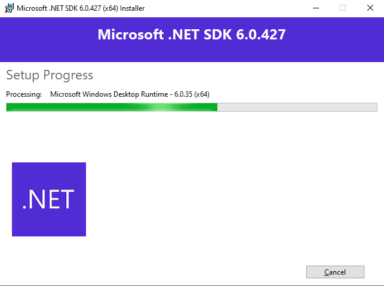

# SportStore

This project is a very simple e-commerce website for sports products.

## Requirements

- [.NET 6.0 SDK](https://dotnet.microsoft.com/en-us/download)

   ```bash
   PS C:\Windows\system32> winget search Microsoft.DotNet.SDK
   Name                           Id                           Version               Source
   -----------------------------------------------------------------------------------------
   Microsoft .NET SDK 3.1         Microsoft.DotNet.SDK.3_1     3.1.426               winget
   Microsoft .NET SDK 5.0         Microsoft.DotNet.SDK.5       5.0.408               winget
   Microsoft .NET SDK 6.0         Microsoft.DotNet.SDK.6       6.0.427               winget
   Microsoft .NET SDK 7.0         Microsoft.DotNet.SDK.7       7.0.410               winget
   Microsoft .NET SDK 8.0         Microsoft.DotNet.SDK.8       8.0.403               winget
   Microsoft .NET SDK 9.0 Preview Microsoft.DotNet.SDK.Preview 9.0.100-rc.2.24474.11 winget
   PS C:\Windows\system32> winget install --id Microsoft.DotNet.SDK --source winget
   No package found matching input criteria.
   PS C:\Windows\system32> winget install --id Microsoft.DotNet.SDK.6 --source winget
   Found Microsoft .NET SDK 6.0 [Microsoft.DotNet.SDK.6] Version 6.0.427
   This application is licensed to you by its owner.
   Microsoft is not responsible for, nor does it grant any licenses to, third-party packages.
   Downloading https://dotnetcli.azureedge.net/dotnet/Sdk/6.0.427/dotnet-sdk-6.0.427-win-x64.exe
   ██████████████████████████████   195 MB /  195 MB
   Successfully verified installer hash
   Starting package install...
   Successfully installed
   ```

   

- [SQL Server](https://www.microsoft.com/en-us/sql-server/sql-server-downloads)

## How to run in development

> These steps assume that you have a SQL Server instance running on your machine. If not, you can use the [SQL Server Docker image](https://hub.docker.com/_/microsoft-mssql-server) to run one. Make sure to set the correct connection string of the SQL Server instance in `src/Server/appsettings.Development.json`.

1. Clone the repository
2. Restore the packages: `dotnet restore src/Server/Server.csproj`
3. Start the server: `dotnet run watch --project src/Server/Server.csproj`

## How to run in production

1. Clone the repository
2. Restore the packages: `dotnet restore src/Server/Server.csproj`
3. Build the server: `dotnet build src/Server/Server.csproj`
4. Publish the server: `dotnet publish src/Server/Server.csproj -c Release -o publish`
5. Make sure the following environment variables are set:
   - `DOTNET_ENVIRONMENT`: environment name, e.g. `Production`
   - `DOTNET_ConnectionStrings__SqlDatabase`: connection string to the SQL Server database
6. Start the server: `dotnet publish/Server.dll`

## How to test

> No database is required to run the unit tests.

1. Clone the repository
2. Restore the packages: `dotnet restore src/Server/Server.csproj` and `dotnet restore tests/Domain.Tests/Domain.Tests.csproj`
3. Run the unit tests for the domain: `dotnet test tests/Domain.Tests/Domain.Tests.csproj`
